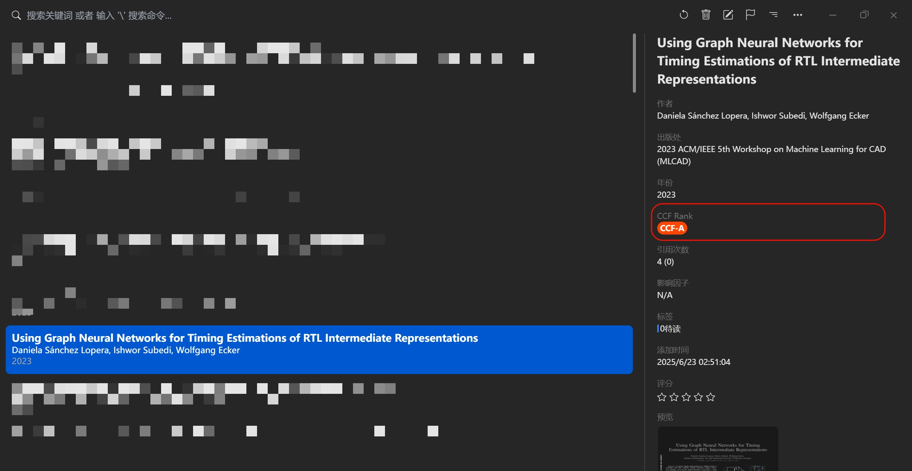

# Paperlib CCF Rank Scrape Extension

[English](#english) | [中文](#中文)

<a name="english"></a>
## English

### Overview
A Paperlib extension that automatically identifies and displays CCF (China Computer Federation) rankings for academic papers. This plugin matches paper publication venues (conferences/journals) against the CCF ranking database and displays the ranking level with color-coded badges in the Paperlib UI.



### Features
- **Automatic CCF Rank Detection**: Automatically identifies CCF rankings (A/B/C) for selected papers
- **Intelligent Matching Algorithm**: Uses multiple matching strategies including:
  - Exact short name matching (e.g., "SIGCOMM", "CVPR")
  - Bracket-based abbreviation extraction
  - Longest common substring algorithm with coverage rate validation
- **Visual Ranking Display**: Color-coded badges for different ranking levels:
  - 🔴 CCF-A (Red)
  - 🟠 CCF-B (Orange)
  - 🟢 CCF-C (Green)
  - ⚪ CCF-none (Gray)
- **Comprehensive Database**: Built-in database with 600+ CCF-ranked conferences and journals

### Installation

1. Install via Paperlib Extension Marketplace (recommended)
2. Or manually install:
   ```bash
   npm install
   npm run build
   ```
   Then load the `dist/` folder as a local extension in Paperlib

### Usage

Simply select a paper in Paperlib, and the extension will automatically:
1. Extract the publication venue information
2. Match it against the CCF ranking database
3. Display the ranking badge in the paper details panel

### Development

#### Build the extension
```bash
npm run build
```

#### Type checking
```bash
npm run prebuild
```

### Technical Details

- **Language**: TypeScript
- **Build Tool**: Vite
- **Output Format**: CommonJS
- **Paperlib API Version**: 0.1.7+

### Repository
- **Homepage**: [https://github.com/Duducoco/paperlib-ccf-rank-scrape-extension](https://github.com/Duducoco/paperlib-ccf-rank-scrape-extension)

---

<a name="中文"></a>
## 中文

### 概述
一个 Paperlib 扩展插件,用于自动识别和显示学术论文的 CCF(中国计算机学会)等级评定。该插件将论文的发表场所(会议/期刊)与 CCF 等级数据库进行匹配,并在 Paperlib UI 中以彩色标签显示等级信息。


### 功能特性
- **自动 CCF 等级检测**: 自动识别选中论文的 CCF 等级(A/B/C)
- **智能匹配算法**: 使用多种匹配策略:
  - 精确短名称匹配(如 "SIGCOMM"、"CVPR")
  - 括号缩写提取
  - 最长公共子串算法配合覆盖率验证
- **可视化等级展示**: 不同等级使用不同颜色标签:
  - 🔴 CCF-A (橙红色)
  - 🟠 CCF-B (橙色)
  - 🟢 CCF-C (绿色)
  - ⚪ CCF-none (灰色)
- **完整数据库**: 内置 600+ 条 CCF 推荐会议和期刊数据

### 安装方法

1. 通过 Paperlib 扩展市场安装(推荐)
2. 或手动安装:
   ```bash
   npm install
   npm run build
   ```
   然后在 Paperlib 中加载 `dist/` 文件夹作为本地扩展

### 使用方法

只需在 Paperlib 中选择一篇论文,扩展将自动:
1. 提取出版场所信息
2. 与 CCF 等级数据库进行匹配
3. 在论文详情面板中显示等级标签

### 开发

#### 构建扩展
```bash
npm run build
```

#### 类型检查
```bash
npm run prebuild
```

### 技术细节

- **开发语言**: TypeScript
- **构建工具**: Vite
- **输出格式**: CommonJS
- **Paperlib API 版本**: 0.1.7+

### 代码仓库
- **主页**: [https://github.com/Duducoco/paperlib-ccf-rank-scrape-extension](https://github.com/Duducoco/paperlib-ccf-rank-scrape-extension)

### 许可证
详见 package.json

### 作者
Duducoco
